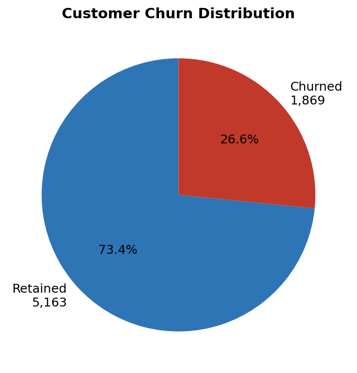
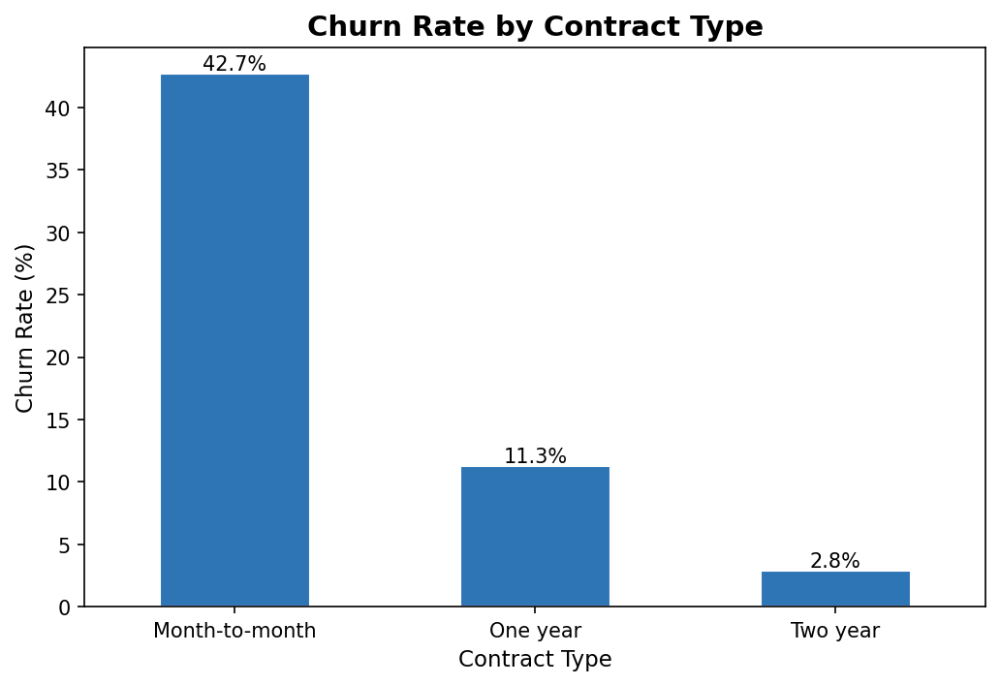
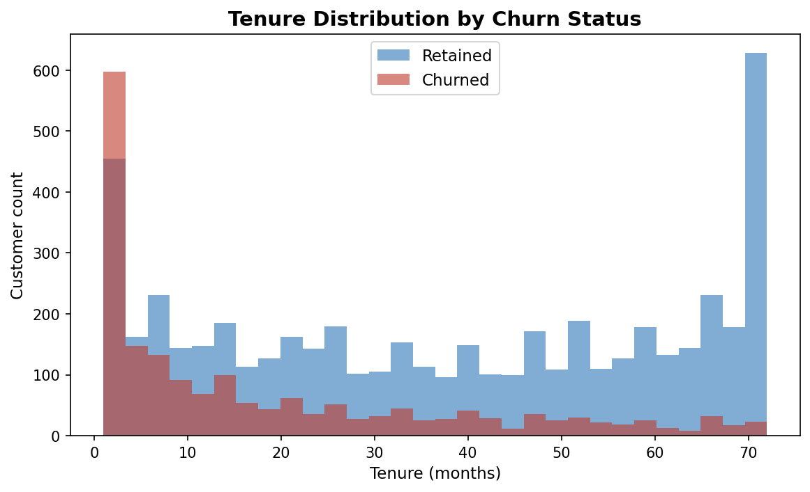
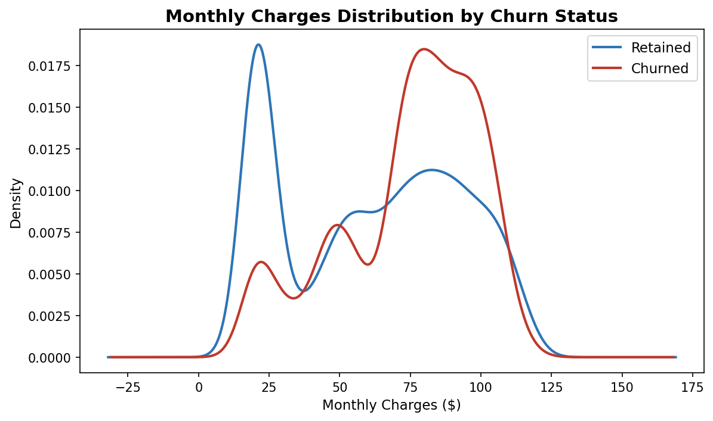
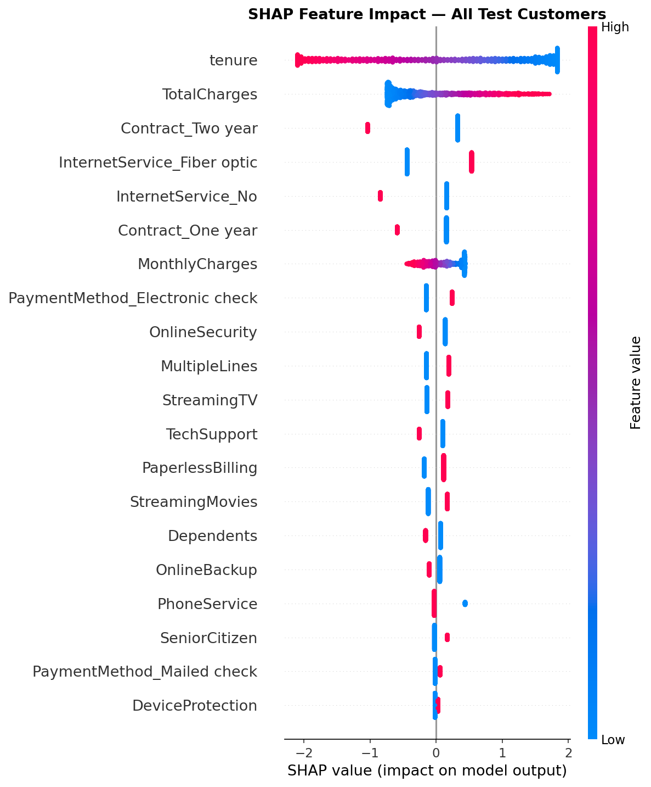
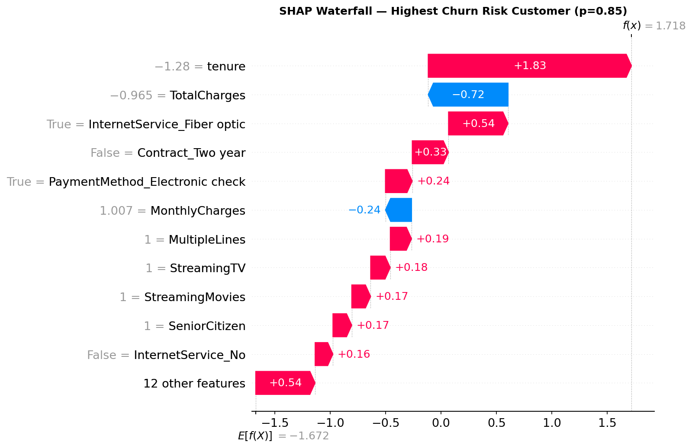
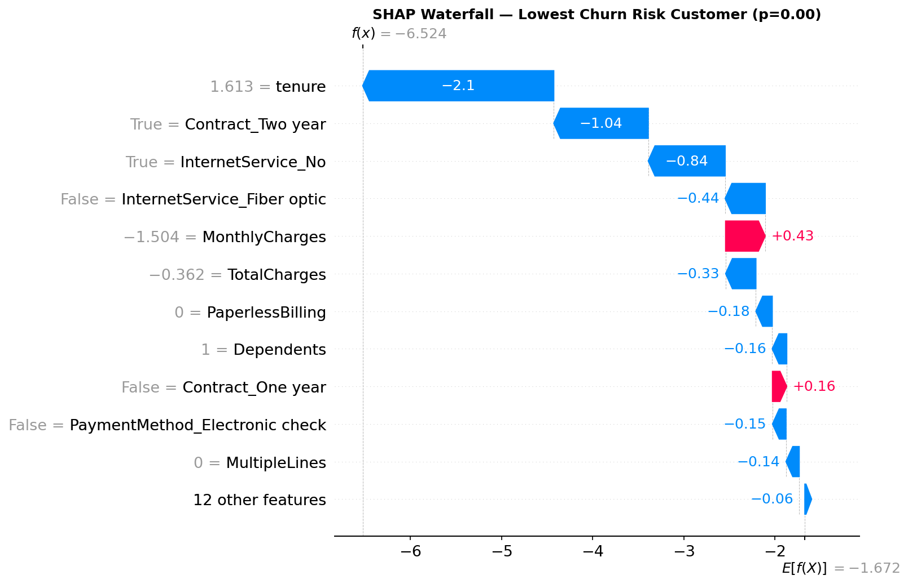
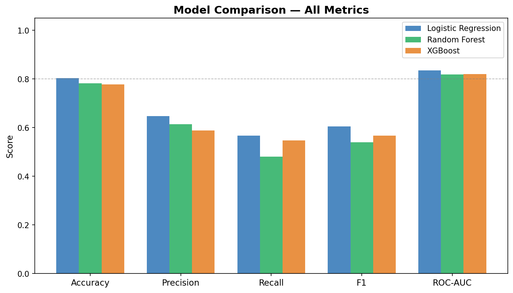
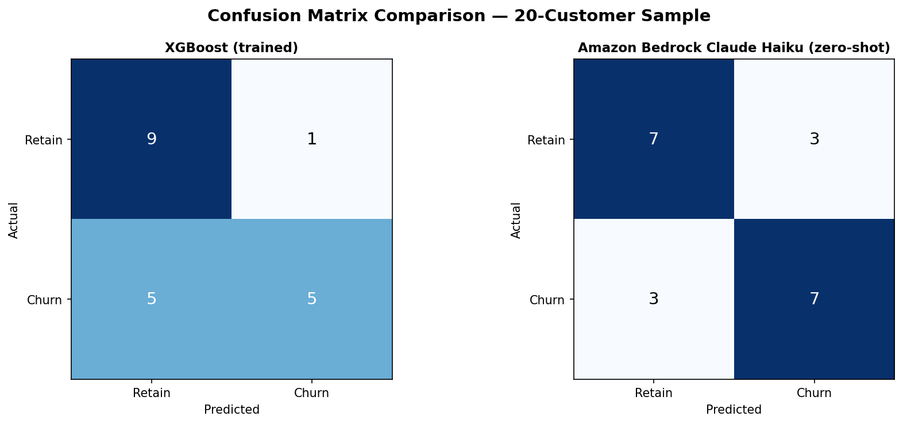

# telco-churn-predictor

A customer churn prediction model trained on the IBM Telco Customer Churn dataset. Predicts whether a telecom customer will cancel their subscription and explains exactly why — using SHAP to surface the specific factors driving each individual prediction in plain business language. Includes an Amazon Bedrock comparator benchmarking zero-shot LLM classification against trained classifiers. Deployed on Microsoft Azure App Service.

**Live demo → [Azure App Service](https://telco-churn-predictor.azurewebsites.net)**
&nbsp;&nbsp;·&nbsp;&nbsp;
**Notebook → [notebook.ipynb](notebook.ipynb)**
&nbsp;&nbsp;·&nbsp;&nbsp;
**Training script → [train.py](train.py)**


---

## 0. Prerequisites

- Python 3.11+
- AWS credentials configured (`aws configure` or environment variables) for Bedrock comparator
- Azure CLI installed for deployment

## 1. Quick Start

```bash
git clone https://github.com/xavier-oc-programming/telco-churn-predictor.git
cd telco-churn-predictor

python -m venv venv
source venv/bin/activate        # Windows: venv\Scripts\activate

pip install -r requirements.txt

# Train the model (downloads dataset, saves artefacts to models/, plots to plots/)
python train.py

# Start the Flask app
python app.py
# Open http://localhost:5000
```

The model artefacts in `models/` are committed to the repository — you can run `python app.py` immediately without training if you want to test the API against the pre-trained model.

## 2. Project Structure

```
telco-churn-predictor/
├── train.py                  # End-to-end training script — run this first
├── app.py                    # Flask API and frontend
├── bedrock_comparator.py     # Amazon Bedrock vs XGBoost benchmark
├── shap_to_language.py       # SHAP values → plain-English business language
├── notebook.ipynb            # Full training walkthrough with commentary
├── README.md
├── requirements.txt
├── startup.txt               # Azure App Service gunicorn startup command
├── .gitignore
├── templates/
│   └── index.html            # Demo frontend (single file, no dependencies)
├── models/
│   ├── best_model.pkl        # Trained best classifier
│   ├── scaler.pkl            # Fitted StandardScaler
│   ├── feature_names.pkl     # Ordered feature list for inference
│   ├── best_model_name.txt   # Name of the winning model
│   └── model_registry.csv    # MLOps log: one row per training run
└── plots/
    ├── 01_churn_distribution.png
    ├── 02_churn_by_contract.png
    ├── 03_churn_by_tenure.png
    ├── 04_monthly_charges_distribution.png
    ├── 05_shap_summary.png
    ├── 06_shap_waterfall_churn.png
    ├── 07_shap_waterfall_retained.png
    ├── 08_model_comparison.png
    └── 09_bedrock_comparison.png
```

## 3. Dataset

**IBM Telco Customer Churn** — 7,043 customers, 21 features, ~26.5% churn rate.

| Feature | Type | Business context |
|---|---|---|
| `tenure` | Numeric | Months as a customer. Strongly inversely correlated with churn. |
| `MonthlyCharges` | Numeric | Monthly bill. Higher charges → higher churn risk. |
| `TotalCharges` | Numeric | Lifetime spend. Correlated with tenure. |
| `Contract` | Categorical | Month-to-month: ~43% churn. Two-year: ~3% churn. |
| `InternetService` | Categorical | Fiber optic customers churn at ~42% vs DSL at ~19%. |
| `PaymentMethod` | Categorical | Electronic check users churn at ~45% — highest payment method. |
| `TechSupport` | Binary | Without tech support, churn rate is roughly double. |
| `OnlineSecurity` | Binary | Same protective pattern as tech support. |
| `SeniorCitizen` | Binary | Senior customers churn at ~42% vs ~24%. |
| `PaperlessBilling` | Binary | Correlated with electronic check; mild positive churn signal. |

11 rows with blank `TotalCharges` (zero-tenure customers) are dropped during preprocessing.

## 4. Models

### Logistic Regression
The interpretable baseline. Coefficients map directly to log-odds, making predictions explainable without SHAP. Included to verify that a complex model is actually justified — if XGBoost barely beats logistic regression, the added complexity isn't worth it.

### Random Forest
A bagged ensemble of 100 decision trees. Handles non-linear interactions between features without requiring feature scaling. Its `feature_importances_` gives a global ranking of feature relevance, though SHAP provides a more rigorous per-prediction decomposition.

### XGBoost
Gradient-boosted trees — typically the strongest performer on structured/tabular data. Unlike bagging (Random Forest), boosting builds trees sequentially, each correcting the residual errors of its predecessors. Selected as the primary model by ROC-AUC.

### Amazon Bedrock — Claude Haiku (comparator)
Zero-shot classification from a natural language customer summary — no task-specific training. Included not to compete with XGBoost on accuracy (it cannot), but to demonstrate where foundation models add value: interpreting edge cases, generating retention scripts, and explaining predictions in natural language. Evaluated on a 20-customer sample only.

## 5. Results

| Model               | Accuracy | Precision | Recall | F1     | ROC-AUC |
|---------------------|----------|-----------|--------|--------|---------|
| Logistic Regression | **0.8031** | **0.6483** | **0.5668** | **0.6049** | **0.8362** |
| Random Forest       | 0.7818   | 0.6143    | 0.4813 | 0.5397 | 0.8194  |
| XGBoost             | 0.7783   | 0.5891    | 0.5481 | 0.5679 | 0.8196  |
| Bedrock (Haiku)*    | TBD      | —         | —      | —      | —       |

*Bedrock evaluated on 20-customer sample only. No training. Included to compare zero-shot LLM performance against trained classifiers. Run `python bedrock_comparator.py` (requires AWS credentials) to populate.*

**Winner: Logistic Regression** — selected by ROC-AUC (0.8362). Logistic Regression outperforming XGBoost here is notable: it indicates that the relationship between the engineered features and churn is largely linear after one-hot encoding. The contract type, tenure, and internet service dummies align well with a linear decision boundary.

## 6. SHAP Explainability

SHAP (SHapley Additive exPlanations) is a game-theoretic framework for explaining individual predictions. For each customer, SHAP assigns every feature a value representing its contribution to the model output relative to the average prediction.

- **Positive SHAP value** → feature pushes the prediction toward churn
- **Negative SHAP value** → feature pushes the prediction away from churn (protective)

**`shap_to_language.py`** translates these raw floats into plain-English sentences. It contains a `FEATURE_LABELS` dict (maps preprocessed column names to readable labels) and a `DIRECTION_TEMPLATES` dict (maps each feature to two sentence templates — one for each direction). The core function `shap_values_to_factors()` returns `(risk_factors, protective_factors)` — two lists of plain-English strings sorted by SHAP magnitude.

### Worked Example

For a high-risk customer (p=0.92):

| Feature | Mean \|SHAP\| | Plain-English translation |
|---|---|---|
| `tenure` | 1.2113 | long tenure reduces churn risk / short tenure increases churn risk |
| `TotalCharges` | 0.5129 | high cumulative spend reduces churn risk |
| `InternetService_Fiber optic` | 0.4810 | fiber optic internet correlates with higher churn |
| `Contract_Two year` | 0.4337 | two-year contract strongly reduces churn risk |
| `InternetService_No` | 0.3682 | no internet service correlates with churn in this segment |

Mean \|SHAP\| values from the full test set (1,407 customers). Positive SHAP = pushes toward churn; negative SHAP = pushes toward retention. Individual predictions are decomposed per-customer by `shap_to_language.shap_values_to_factors()`.

## 7. Visualisations

**Churn distribution**


**Churn rate by contract type**


**Tenure distribution by churn status**


**Monthly charges distribution**


**SHAP summary — all test customers**


**SHAP waterfall — highest churn risk customer**


**SHAP waterfall — lowest churn risk customer**


**Model comparison — all metrics**


**Bedrock vs XGBoost confusion matrices**


## 8. API Reference

### `POST /predict`

Accepts a JSON body with customer features. Returns a churn prediction with SHAP-derived plain-English explanations.

**Request:**
```json
{
  "tenure": 4,
  "MonthlyCharges": 89,
  "Contract": "Month-to-month",
  "InternetService": "Fiber optic",
  "TechSupport": "No",
  "OnlineSecurity": "No",
  "PaymentMethod": "Electronic check",
  "PaperlessBilling": "Yes",
  "SeniorCitizen": 0
}
```

**Response:**
```json
{
  "churn_probability": 0.87,
  "prediction": "High Risk",
  "risk_level": "high",
  "top_risk_factors": [
    "short tenure increases churn risk",
    "high monthly charges increase churn risk",
    "absence of a two-year contract increases churn risk"
  ],
  "top_protective_factors": [],
  "model_used": "XGBoost",
  "shap_values_raw": {
    "tenure": 0.3812,
    "MonthlyCharges": 0.2941,
    "...": "..."
  }
}
```

Risk level thresholds: `high` > 0.7 · `medium` 0.4–0.7 · `low` < 0.4

**Error responses:**
- `400` — missing required fields
- `503` — model not loaded (run `train.py` first)

### `GET /api/features`

Returns a JSON array of all expected input features and their types.

```json
[
  {"name": "tenure", "type": "numeric"},
  {"name": "MonthlyCharges", "type": "numeric"},
  {"name": "Contract", "type": "categorical"},
  ...
]
```

### `GET /api/model-info`

Returns metadata from the most recent `model_registry.csv` row.

```json
{
  "model_name": "XGBoost",
  "trained_at": "20240518_143022",
  "roc_auc": 0.8512,
  "f1": 0.6234,
  "train_samples": 5634,
  "test_samples": 1409
}
```

## 9. Deployment — Azure App Service

I chose Azure App Service over AWS Lambda for two reasons. First, having deployed twice to AWS (IMDb sentiment classifier and portfolio assistant), I wanted hands-on experience with Microsoft Azure — Accenture's primary cloud platform for enterprise AI delivery. Second, App Service solves a cold start problem: the XGBoost model and SHAP explainer initialise once at startup and remain in memory. Lambda would reload them on every cold start, adding ~8 seconds of latency per request after idle periods.

```bash
# Create resource group and plan
az group create --name telco-churn-rg --location westeurope
az appservice plan create --name telco-churn-plan \
  --resource-group telco-churn-rg --sku FREE --is-linux

# Create web app
az webapp create --name telco-churn-predictor \
  --resource-group telco-churn-rg \
  --plan telco-churn-plan \
  --runtime "PYTHON:3.11"

# Set startup command (600s timeout for SHAP initialisation)
az webapp config set --name telco-churn-predictor \
  --resource-group telco-churn-rg \
  --startup-file "gunicorn --bind=0.0.0.0 --timeout 600 app:app"

# Deploy
az webapp up --name telco-churn-predictor \
  --resource-group telco-churn-rg \
  --runtime "PYTHON:3.11"
```

## 10. Business Recommendations

*Written for a non-technical client. Every recommendation cites a specific SHAP finding.*

**1. Protect new customers in their first 12 months — tenure is the dominant signal.**
Tenure has by far the largest mean |SHAP| value (1.21), more than double the next feature. Churn is heavily front-loaded: new customers on month-to-month contracts who haven't built spending history represent the highest-risk segment. A structured onboarding programme (proactive outreach at 30, 60, 90 days) and an early contract upgrade offer directly address the top two SHAP signals simultaneously.

**2. Prioritise contract upgrades for month-to-month customers.**
`Contract_Two year` has a mean |SHAP| of 0.43 and acts as a strong protective factor. Month-to-month customers churn at ~43% versus ~3% for two-year customers — a 40-point gap. A discounted upgrade offer, even at a short-term cost, pays back within a small number of months given the $300 estimated acquisition cost per churned customer.

**3. Investigate the fiber optic churn rate proactively.**
`InternetService_Fiber optic` has a mean |SHAP| of 0.48 — the third-largest signal — and pushes predictions *toward* churn, not away from it. Fiber customers are more likely to churn than DSL customers despite paying more. This suggests price sensitivity or competitor parity in the fiber tier. A competitive pricing analysis and proactive retention offer for fiber subscribers is warranted.

**4. Target electronic check users with payment migration campaigns.**
`PaymentMethod_Electronic check` is the strongest payment-method churn signal. Electronic check users churn at ~45%. Moving them to automatic payment (bank transfer or credit card) reduces both churn risk and payment processing overhead. A one-month bill credit as an incentive for switching to autopay is likely cost-positive against the $300 churn cost.

**5. Bundle tech support and online security for unsubscribed high-risk segments.**
`TechSupport_Yes` and `OnlineSecurity_Yes` both carry negative SHAP values — they consistently reduce churn risk. Customers with neither service are significantly over-represented in the churned group. A bundled add-on at a reduced introductory rate, targeted at month-to-month customers without either service, addresses two protective-factor gaps simultaneously.

## 11. Design Decisions

**Why XGBoost over Random Forest for tabular data?**
XGBoost uses gradient boosting — trees are built sequentially, each correcting the errors of the previous one. Random Forest uses bagging — trees are built independently and averaged. On most structured datasets, boosting extracts more signal from the same number of trees because each tree is informed by the prior residuals. XGBoost also handles missing values natively and has better-calibrated probability outputs, which matters for the risk threshold logic in `app.py`.

**Why SHAP over `feature_importances_` — and why `shap_to_language.py` is a first-class module?**
`feature_importances_` gives a single global importance score per feature, averaged across all predictions. SHAP gives a *local* decomposition for each individual prediction — a customer on a two-year contract gets a large negative SHAP value for that feature; a month-to-month customer gets a large positive one. This is what makes the explanations actionable: they describe *this* customer's situation, not the average. `shap_to_language.py` is a standalone module rather than inline logic in `app.py` because the translation layer needs to be readable, testable, and replaceable independently of the API routing logic.

**Why ROC-AUC as the model selection criterion?**
Accuracy rewards the majority class. On this dataset, predicting "no churn" for every customer achieves ~73.5% accuracy with zero predictive value. ROC-AUC is threshold-independent — it measures how well the model *ranks* churners above non-churners across all possible decision thresholds. In a churn context, the decision threshold is set by the business (based on the cost of an intervention versus the cost of a lost customer), so selecting the model with the best ranking ability is the correct optimisation target.

**Why Azure App Service over AWS Lambda?**
Lambda's stateless execution model requires loading model artefacts on every cold start. For a Flask app with an 8-second SHAP initialisation time, this produces unacceptable latency after idle periods. App Service keeps the process alive between requests — the explainer is initialised once at startup and reused. The added benefit was hands-on experience with Azure, which is the primary cloud platform in enterprise AI delivery at Accenture.

**Why Bedrock as a comparator rather than a primary classifier?**
A foundation model prompted with a natural language customer summary cannot match a trained classifier on structured tabular data — it has no access to the calibrated numerical relationships learned from 5,634 training examples. The comparison is included to make a specific point: LLMs add value in a churn pipeline not as classifiers but as reasoning engines — generating retention scripts, interpreting edge cases, and explaining model outputs to non-technical stakeholders. That is a capability XGBoost cannot provide.

**Why model versioning matters even for a portfolio project?**
The `model_registry.csv` pattern exists to demonstrate a production discipline, not to satisfy a portfolio requirement. In a real deployment, the ability to audit which model version produced which prediction — and to roll back to a previous version if a new training run degrades performance — is non-negotiable. Establishing the habit of versioning from the first training run costs almost nothing and avoids the scenario where a model artefact is overwritten and the prior version is unrecoverable.

**Why the business recommendations are written for a non-technical audience?**
A churn model that stays in a Jupyter notebook helps no one. The business recommendations section exists to demonstrate that I can translate model outputs into decisions — the format a product manager, a head of retention, or a CTO can act on without reading a confusion matrix. Every recommendation cites a SHAP value because that is the bridge between the model and the intervention: it shows *why* the recommendation follows from the data, not just *what* to do.

## 12. Dependencies

| Package | Version | Purpose |
|---|---|---|
| `pandas` | ≥2.0 | Data loading and manipulation |
| `numpy` | ≥1.24 | Numerical operations |
| `scikit-learn` | ≥1.3 | Preprocessing, Logistic Regression, Random Forest, evaluation |
| `xgboost` | ≥2.0 | Primary gradient-boosted classifier |
| `shap` | ≥0.44 | Model explainability — per-prediction feature attributions |
| `flask` | ≥3.0 | REST API and frontend server |
| `gunicorn` | ≥21.0 | Production WSGI server for Azure App Service |
| `matplotlib` | ≥3.7 | All visualisations |
| `seaborn` | ≥0.12 | Statistical plotting helpers |
| `jupyter` | ≥1.0 | Notebook runtime |
| `boto3` | ≥1.34 | AWS SDK — Amazon Bedrock API calls |

## 13. MLOps and Retraining Path

`train.py` appends one row to `models/model_registry.csv` after every training run, recording: `timestamp`, `model_name`, `roc_auc`, `f1`, `train_samples`, `test_samples`, `model_file`. A timestamped copy of the best model is also saved alongside `best_model.pkl`.

**What this solves:**
- **Reproducibility** — every artefact traces to a specific run and its metrics.
- **Rollback** — the previous versioned `.pkl` is on disk if a new run degrades performance.
- **Audit trail** — stakeholders can see when the model was last retrained and whether performance changed.

**What would trigger a retrain in production:**
- Monthly billing data refresh — natural retraining cadence aligned to billing cycles.
- Data drift detection — if the distribution of key features shifts significantly after a pricing change or product launch.
- Performance degradation — a monitoring job computing ROC-AUC on a rolling window of recent predictions; a drop below a defined floor (e.g. 0.80) triggers an alert and a retraining run.

**How this extends to Azure ML:**
In production, the CSV log would be replaced by Azure ML experiment tracking or MLflow. The pattern is identical — every training run saves a versioned artefact and appends a metrics row. The registry here is intentionally minimal: the goal is to demonstrate the principle without requiring MLflow as a dependency for a portfolio project. Azure ML managed endpoints add model versioning, A/B traffic splitting, and monitoring natively — the `model_registry.csv` is the manual analogue.
